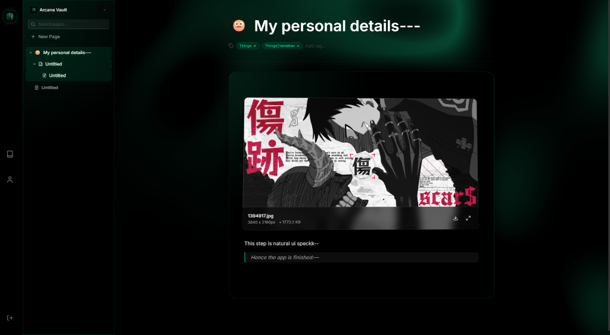
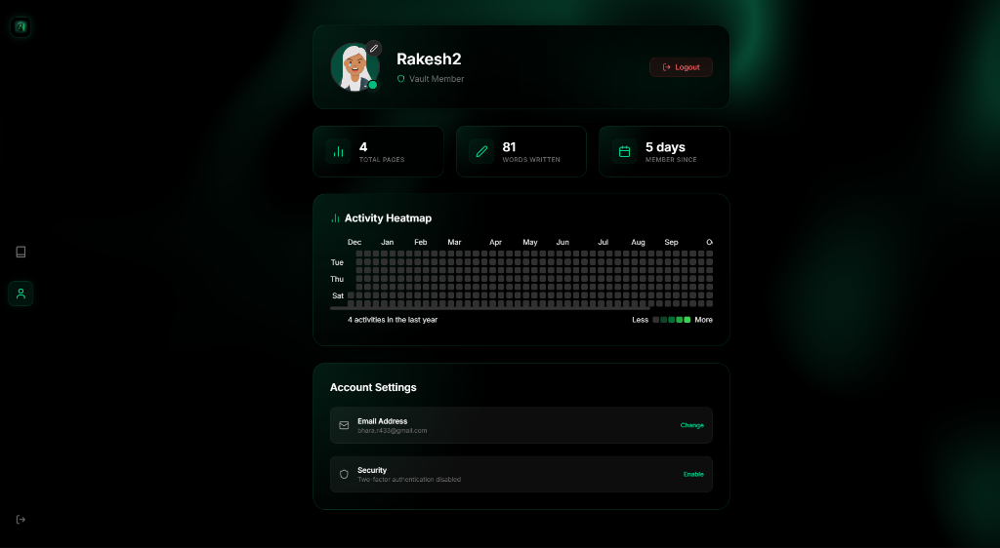

# Arcane Vault 🔮

**A calm, magical, personal notes sanctuary.**

Arcane Vault is a personal knowledge management tool designed with a focus on aesthetics, privacy, and user experience. It features a "liquid glass" design system, emerald-themed visualizations, and a seamless writing experience.



## ✨ Features

- **Liquid Glass UI**: A stunning, modern interface with glassmorphism effects, dynamic glows, and smooth animations.
- **Distraction-Free Editor**: A clean, block-based editor powered by Tiptap, supporting rich text, images, code blocks, and more.
- **Activity Heatmap**: GitHub-style activity tracking to visualize your writing consistency over time.
- **Profile Customization**: Choose from a curated set of emerald-themed avatars to personalize your vault identity.
- **Security**:  Authentication powered by **Supabase**, including secure email login and Two-Factor Authentication (2FA). Designed with a local-first mindset.
- **Mobile & PWA Ready**: Fully responsive design with Progressive Web App support for installable access.
## 📸 Screenshots

### Login Experience
*Enter your sanctuary with a secure, magic-link inspired authentication flow.*


### Personal Dashboard
*Track your progress, manage settings, and view writing stats.*


## 🛠️ Tech Stack

- **Frontend**: React, TypeScript, Vite
- **Styling**: Tailwind CSS, Framer Motion (animations)
- **Editor**: Tiptap
- **Backend / Database**: Supabase (PostgreSQL, Auth)
- **Deployment**: Render / Vercel compatible

## 🚀 Getting Started

1.  **Clone the repository**:
    ```bash
    git clone https://github.com/rakeshacharyaaa/arcane-vault.git
    cd arcane-vault
    ```

2.  **Install dependencies**:
    ```bash
    npm install
    # or
    yarn install
    ```

3.  **Start development server**:
    ```bash
    npm run dev
    ```

4.  **Build for production**:
    ```bash
    npm run build
    ```

## 📄 License

MIT License - feel free to use this code for your own personal vault! 
