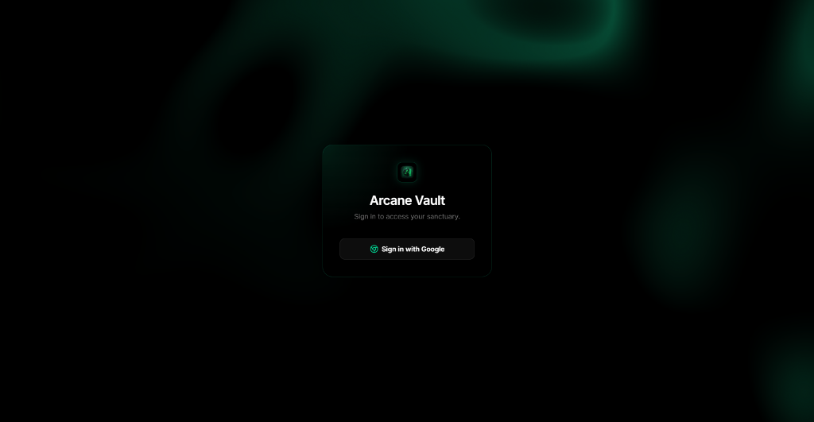
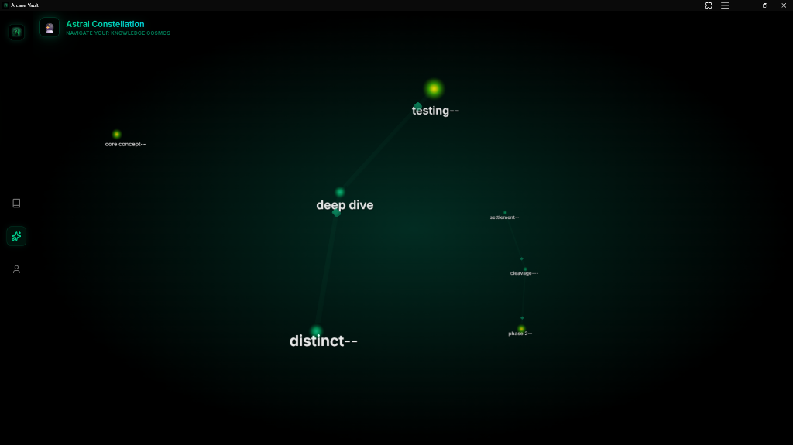
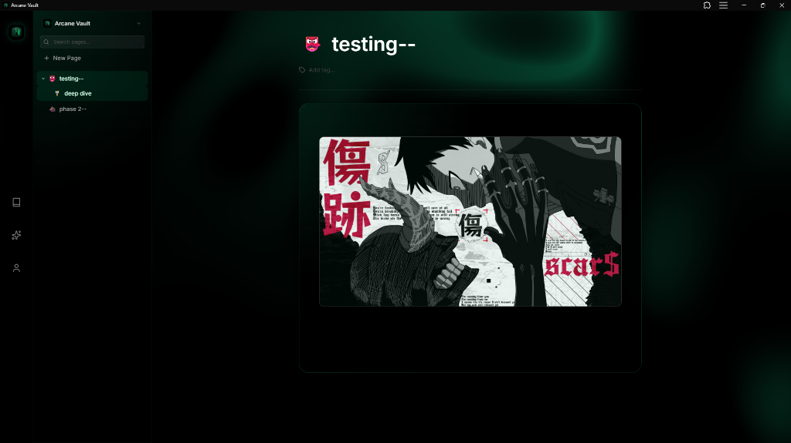
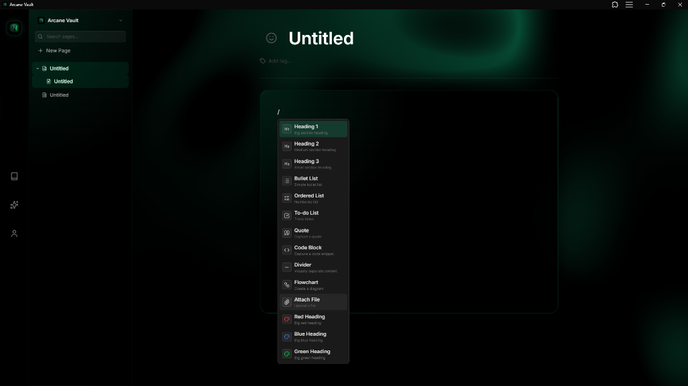
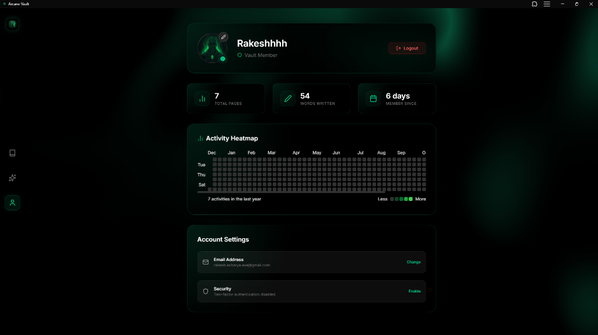

# Arcane Vault 🔮

> **A second brain for wizards.**
> *Visualize your knowledge in a 3D cosmos.*



Arcane Vault is a next-generation **Personal Knowledge Management (PKM)** tool designed for those who value aesthetics as much as utility. It combines a powerful infinite-depth note-taking system with a stunning **Astral Graph** visualization, all wrapped in a premium "Emerald & Glass" UI.

## ✨ Features

### 🌌 The Astral Graph
Abandon the static list. See your thoughts as a living, breathing **3D Constellation**.
- **Force-Directed Layout**: Nodes attract and repel naturally.
- **Interactive 3D**: Zoom, pan, and rotate through your knowledge universe.
- **Visuals**: glowing sprites, distance fog, and dynamic text labels.



### 📝 Infinite Hierarchical Notes
- **Recursive Depth**: Create sub-pages inside sub-pages infinitely.
- **Tiptap Editor**: A block-based, distraction-free writing experience.
- **Real-time Sync**: Autosaving to Supabase (PostgreSQL).



### 🛡️ Secure & Private
- **Authentication**: Powered by **Supabase Auth** (Google OAuth + Magic Links).
- **Row Level Security (RLS)**: Your notes are encrypted and only accessible by you.



### 🎨 Premium "Mage-OS" UI
- **Liquid Glass**: Glassmorphism, blurs, and noise textures.
- **Emerald Theme**: A soothing, deep green palette.
- **Responsive**: Fully optimized for Desktop and Mobile (PWA support).



---

## 🛠️ Tech Stack

| Component | Tech |
|-----------|------|
| **Core** | React 18, TypeScript, Vite |
| **3D / Graph** | `react-force-graph-3d`, `Three.js` |
| **State** | Zustand (with Local Persistence) |
| **Styling** | TailwindCSS, Lucide Icons |
| **Backend** | Supabase (Postgres, Auth) |

---

## 🚀 Getting Started

1. **Clone**
   ```bash
   git clone https://github.com/rakeshacharyaaa/arcane-vault.git
   cd arcane-vault
   ```

2. **Install**
   ```bash
   npm install
   ```

3. **Configure Environment**
   Create a `.env` file with your Supabase credentials:
   ```env
   VITE_SUPABASE_URL=your_project_url
   VITE_SUPABASE_ANON_KEY=your_anon_key
   ```

4. **Run**
   ```bash
   npm run dev
   ```
   Open [http://localhost:5173](http://localhost:5173) to enter the vault.

## 📜 License

MIT
